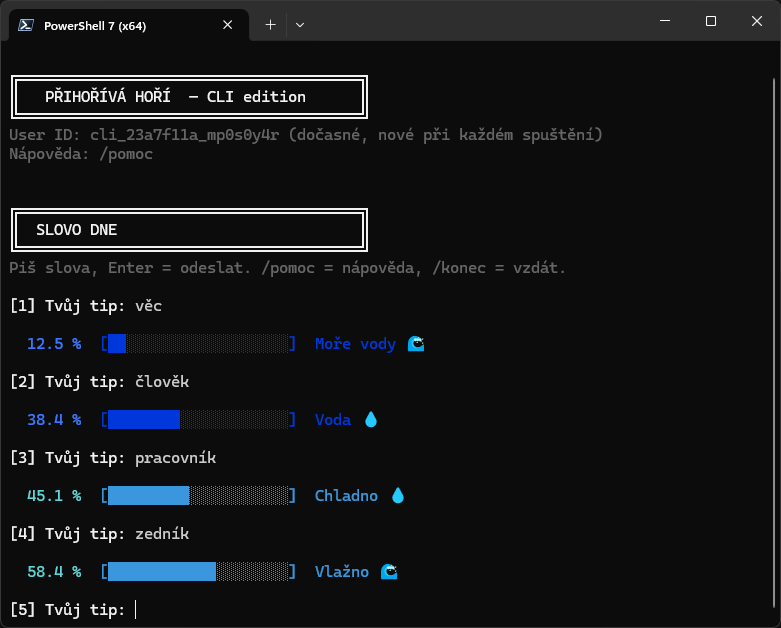

# Přihořívá Hoří — CLI

Terminálová verze hry [prihorivahori.cz](https://prihorivahori.cz) napsaná v Node.js.

## Ukázka



## Spuštění

```bash
node play.mjs
```

Nevyžaduje žádné závislosti — pouze Node.js 18+.

## Jak se hraje

Hádáš tajné slovo. Po každém hádání dostaneš procentuální shodu s cílovým slovem — čím blíže 100 %, tím teplejší. Hra má dvě kola:

1. **Slovo dne** — denní výzva pro všechny
2. **Megaslovo týdne** — odemkne se po uhádnutí slova dne (obtížnější)

## Pravidla zadávání

| Podmínka | Limit |
|---|---|
| Minimální délka | 2 znaky |
| Maximální délka | 20 znaků |
| Povolené znaky | Česká písmena (včetně háčků a čárek), pomlčka `-`, apostrof `'` |
| Mezery | Nejsou povoleny |
| Čekání mezi pokusy | 2 sekundy (může být upraveno serverem) |
| Opakované hádání | Není dovoleno — ukáže se uložený výsledek bez nového pokusu |

## Příkazy

| Příkaz | Popis |
|---|---|
| `/pomoc` | Zobrazí nápovědu |
| `/seznam` | Vypíše všechny pokusy v pořadí odeslání s jejich přesností |
| `/top` | Zobrazí 10 nejlepších pokusů |
| `/konec` | Vzdej aktuální kolo |
| `/vzdej` | Stejné jako `/konec` |
| `/exit` | Okamžitě ukončí program |

## Stupnice teplot

| Shoda | Stav |
|---|---|
| 100 % | HOŘÍ! 🔥🔥🔥 |
| 95–99 % | Pálí! 🔥🔥 |
| 85–94 % | Přihořívá! 🔥 |
| 75–84 % | Horko ♨️ |
| 65–74 % | Teplo 🌡️ |
| 55–64 % | Vlažno 🌊 |
| 45–54 % | Chladno 💧 |
| 35–44 % | Voda 💧 |
| 25–34 % | Samá voda 🌊 |
| 15–24 % | Voda, voda 🌊 |
| 5–14 % | Moře vody 🌊 |
| 0–4 % | Led, všude led 🧊 |

## Technické poznámky

- Validace vstupu zrcadlí logiku živého webu (funkce `Mt` z JS bundle).
- Výchozí prodleva mezi pokusy je 2 000 ms — stejně jako na webu.
- Při opakovaném hádání se výsledek bere z lokální cache; čítač pokusů se nezvyšuje a server se nekontaktuje.
- Aplikace je anonymní — nepotřebuje Firebase ani přihlášení.