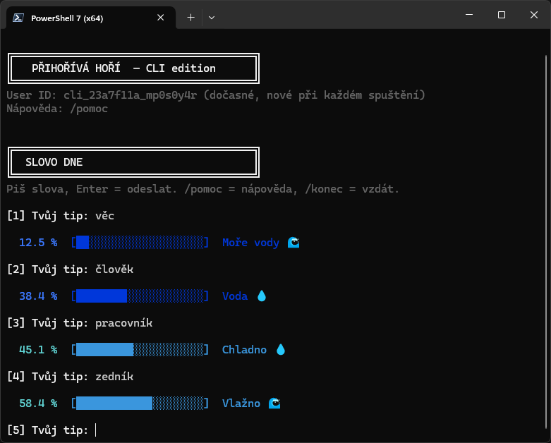

# Přihořívá Hoří — CLI

Terminálová verze hry [prihorivahori.cz](https://prihorivahori.cz) napsaná v Node.js.

## Ukázka



## Spuštění

```bash
node play.mjs                     # jen limity, které vynucuje server
node play.mjs --browser-parity    # navíc všechna omezení, která hlídá web
node play.mjs --mega              # začne rovnou megaslovem (vyžaduje účet)
node play.mjs --email ja@example.cz   # přihlásí se hned při startu
```

Nevyžaduje žádné závislosti — pouze Node.js 18.3+.

Heslo se zadává skrytě do výzvy, nebo ho lze předat proměnnou prostředí
`PRIHORIVA_PASSWORD` (e-mail případně v `PRIHORIVA_EMAIL`). Heslo záměrně nejde
zadat jako argument, aby nezůstalo v historii shellu.

## Jak se hraje

Hádáš tajné slovo. Po každém hádání dostaneš procentuální shodu s cílovým slovem — čím blíže 100 %, tím teplejší. Herní režimy:

1. **Slovo dne** — denní výzva pro všechny, hraje se i bez účtu
2. **Megaslovo týdne** — obtížnější, **vyžaduje účet** (registrace zdarma na webu)
3. **Archiv** — starší slova dne, **jen s Premium**
4. **Slovo skupiny** — slovo zadá člen skupiny, ostatní ho hádají; hádat jde zdarma,
   zakládat skupiny a zadávat slova jen s Premium

Navíc `/kamaradi` ukáže, jak dnes hrají kamarádi (jen pro čtení).

## Co je potřeba

| | Účet | Premium | Bez Premia |
|---|---|---|---|
| Slovo dne | ❌ (anonymní `X-User-ID`) | ❌ | plně hratelné |
| Megaslovo týdne | ✅ server vrací `401 sign_in_required` | ❌ | 50 tipů za herní den (začíná ve 3:00) |
| Archiv slova dne | ✅ | ✅ server vrací `402 premium_required` | kalendář je vidět, hrát nejde |
| Archiv megaslova | ✅ | ✅ | jen prohlížení odehraných týdnů; hrát nejde ani s Premium (není endpoint) |
| Hádání slova skupiny | ✅ | ❌ | max. 1 skupina, do které tě pozve správce |
| Založení skupiny | ✅ | ✅ `402` | — (CLI neumí, dělá se na webu) |
| Zadání slova skupině | ✅ | ✅ | — (CLI neumí, dělá se na webu) |
| Kamarádi | ✅ | ❌ | max. 6 kamarádů |

**Ověření e-mailu není potřeba k ničemu** — neověřený účet má stejný přístup jako
ověřený (vyzkoušeno). Přihlášení používá stejný Firebase projekt jako web
(e-mail + heslo přes REST API Firebase Auth, reCAPTCHA vynucená není).
Přihlášenému hráči se průběh slova dne i megaslova načte ze serveru
(`/user/game_state`), takže lze pokračovat v rozehrané hře z webu i naopak.
Přihlášení přes Google CLI nepodporuje — je potřeba mít na webu nastavené heslo.

## Kdo co vynucuje

Ověřeno sondováním živého backendu (anonymně i s účtem bez Premia) a JS bundlu
webu, říjen 2026.

### Slovo dne a megaslovo

| Omezení | Web (frontend) | Server (backend) | CLI výchozí | CLI `--browser-parity` |
|---|---|---|---|---|
| Délka 2–20 znaků | ✅ | ✅ `400` | server | lokálně + server |
| Povolené znaky (česká písmena, `-`, `'`) | ✅ regex z `/word_rules` | ✅ `400` | server | lokálně + server |
| Jen jedno slovo (žádné mezery) | ✅ vlastní hláška | ✅ jako „nepovolené znaky“ | server | lokálně + server |
| Prodleva mezi pokusy | ✅ 2 s, pak `recommended_cooldown` | ❌ (desítky rychlých požadavků projdou) | ne | ano |
| Prodleva se spouští i u neplatného / opakovaného slova | ✅ | — | ne | ano |
| Opakované slovo se neposílá, ukáže se z cache | ✅ | ❌ přijme ho a **započítá jako pokus** (i tip z limitu megaslova) | pošle se | z cache |
| Hádání po uhádnutí | ❌ vstup zmizí | *neověřeno* | pošle se | blokováno |
| Megaslovo jen s účtem | ✅ | ✅ `401` | ano | ano |
| Megaslovo až po uhádnutí slova dne | ✅ | ❌ (vyzkoušeno) | ne | ano |
| Denní limit tipů na megaslovo (50) | ✅ skryje vstup | ✅ `429 {"error":"mega_daily_limit","limit":50,"used":50}` | server | lokálně + server |
| Max. 3 pomlčky / 2 apostrofy (`/word_rules`) | ❌ | ❌ (vrátí 0 %) | ne | ne |

Neplatné slovo (400) se do pokusů ani do limitu megaslova nepočítá a validace má
přednost i před vyčerpaným limitem. Počet pokusů si server vede sám — parametr
`guesses`, který web posílá u slova dne, ignoruje.

### Archiv a skupiny

| Omezení | Web (frontend) | Server (backend) | CLI výchozí | CLI `--browser-parity` |
|---|---|---|---|---|
| Archiv jen s Premium | ✅ zámek podle kalendáře `/archive` | ✅ `402` (stav i hádání) | server | kalendář + server |
| Dnešní den v archivu → běžná hra | ✅ | ? (server nejdřív vrací `402`) | ano | ano |
| Validace slova | ❌ jen ořízne a převede na malá | *neověřeno* (bez Premia nejde) | server | server |
| Prodleva mezi pokusy | ✅ 2 s, spouští se až odesláním | *neověřeno* | ne | ano |
| Opakované slovo v archivu | ✅ z cache | *neověřeno* | pošle se | z cache |
| Opakované slovo ve skupině | ✅ „Tohle slovo už jsi zkoušel/a“ | ✅ `already_guessed` (podle bundlu) | server | lokálně + server |
| Kdo slovo zadal, ten ho nehádá | ✅ | *neověřeno* | server | blokováno |
| Cizí skupina | — | ✅ `403 forbidden` | server | server |
| Založení skupiny jen s Premium | ✅ paywall | ✅ `402` | — | — |

Hádání ve skupině je napsané podle kódu webu, ale **nebylo vyzkoušené naživo** —
testovací účet bez Premia nemůže skupinu založit a v žádné není.

Shrnutí: **server hlídá** formát slova, přihlášení, denní limit megaslova,
Premium a členství ve skupinách. **Jen web hlídá** prodlevu mezi pokusy,
neposílání opakovaných slov (kromě skupin), odemčení megaslova přes slovo dne
a hádání po výhře — tato omezení CLI zapíná přepínačem `--browser-parity`.

### Server

- Anonymní endpointy: `/similarity`, `/health` (feature flagy), `/word_rules`,
  `/stats`, `/weekly/stats`, `/yesterdays_word`, `/weekly/last_word`, `/pricing`,
  `/increment_correct_guesses` (ten nemá žádnou ochranu — kdokoli může zvýšit
  počítadlo uhádnutí).
- Vyžadují přihlášení (`Authorization: Bearer <Firebase ID token>`, bez něj `401`):
  `/weekly/similarity`, `/user/*`, `/auth/profile`, `/me/refresh`, `/archive*`,
  `/groups*`, `/friends*`, `/gift/*`, `/notifications`.
- Žebříčky (`/leaderboard`, `/weekly/leaderboard`) aktuálně vrací `404`.
- Počet pokusů do výhry si server u slova dne i megaslova vede sám (parametr
  `guesses` od klienta ignoruje). Hostní endpointy `/user/claim_guest_win`
  a `/user/carry_guest_progress` ale podle kódu webu berou počet pokusů z těla
  požadavku — naživo neověřeno. CLI tyto endpointy nevolá.
- `recommended_cooldown` je jen doporučení: `500` ms pro slova v cache serveru,
  `2000` ms pro nová slova. Vynucený není.
- Hlavička `X-User-ID` není povinná; web posílá navíc `X-Lang: cs` a u přihlášených
  `X-Auth-Expected: 1`. CLI posílá totéž.
- Odkaz pro ověření e-mailu v registračním mailu vede na backend
  (`backend-dot-prihoriva…/?mode=verifyEmail…`), který vrací `404`. Kód z odkazu
  jde uplatnit přímo přes Firebase (`accounts:update` s `oobCode`).

## Příkazy

| Příkaz | Popis |
|---|---|
| `/pomoc` | Zobrazí nápovědu |
| `/seznam` | Vypíše všechny pokusy v pořadí odeslání s jejich přesností |
| `/top` | Zobrazí 10 nejlepších pokusů |
| `/denni` | Přepne na slovo dne |
| `/mega` | Přepne na megaslovo týdne (nabídne přihlášení) |
| `/archiv` | Kalendář archivu (posledních 14 dní) |
| `/archiv RRRR-MM-DD` | Zahraje si den z archivu (Premium) |
| `/skupiny` | Tvoje skupiny a stav jejich slov |
| `/skupina <číslo>` | Hádá slovo skupiny (číslo z `/skupiny`, nebo ID skupiny) |
| `/kamaradi` | Jak dnes hrají kamarádi |
| `/prihlasit` | Přihlášení e-mailem a heslem |
| `/konec`, `/vzdej` | Vzdá a ukončí program |
| `/exit` | Okamžitě ukončí program |

## Stupnice teplot

| Shoda | Stav |
|---|---|
| 100 % | HOŘÍ! 🔥🔥🔥 |
| 95–99 % | Pálí! 🔥🔥 |
| 85–94 % | Přihořívá! 🔥 |
| 75–84 % | Horko ♨️ |
| 65–74 % | Teplo 🌡️ |
| 55–64 % | Vlažno 🌊 |
| 45–54 % | Chladno 💧 |
| 35–44 % | Voda 💧 |
| 25–34 % | Samá voda 🌊 |
| 15–24 % | Voda, voda 🌊 |
| 5–14 % | Moře vody 🌊 |
| 0–4 % | Led, všude led 🧊 |

## Technické poznámky

- Kontroly s `--browser-parity` zrcadlí obsluhu odeslání na webu pro každý režim
  zvlášť (u slova dne a megaslova validace `Ou` a prodleva spuštěná před validací,
  u archivu a skupin bez validace a s prodlevou až po odeslání). Pravidla
  (`min_length`, `char_pattern`) se stahují z `/word_rules`.
- Bez `--browser-parity` se slovo jen ořízne a převede na malá písmena, zbytek
  validuje server a CLI zobrazí jeho chybovou hlášku.
- Po uhádnutí slova dne CLI volá `/increment_correct_guesses` stejně jako web.
- Anonymní průběh slova dne se na serveru neukládá — nové spuštění = nový hráč.
- Herní den začíná ve 3:00 pražského času (stejně jako na webu).
